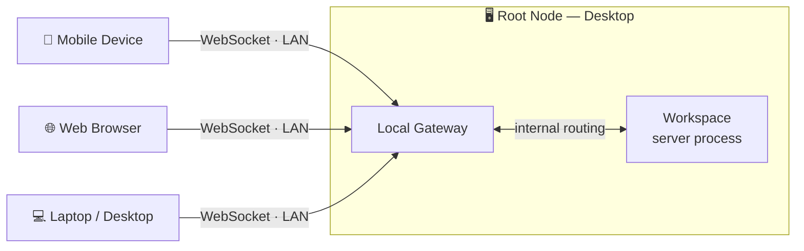
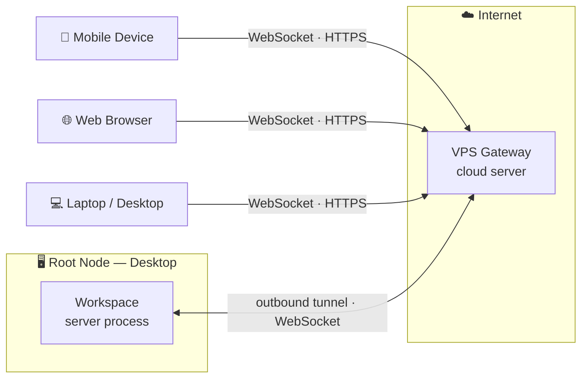
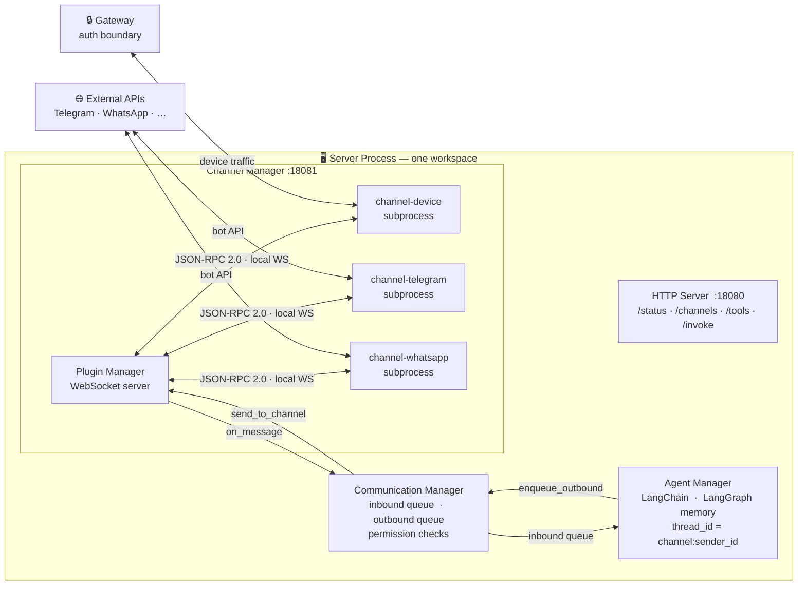

Private Home Box (PHB) is a personal AI infrastructure that runs on your own hardware. Your desktop is the root of trust: it holds the master key, runs the AI agents, and owns all data. External devices and services connect to it — never the other way around.

## Key concepts

| Concept | What it is |
|---|---|
| **Root Node** | Your desktop. Runs one or more workspaces. The master key lives here. |
| **Workspace** | An isolated server process (config, keys, ports, channels). You can have `production`, `dev`, `test` — each fully independent. |
| **Gateway** | The authentication and routing boundary between device nodes and a workspace. Can run locally or on a VPS. |
| **Device Node** | Any client that connects to PHB — mobile app, web browser, another desktop. |
| **Channel** | A messaging integration (Telegram, WhatsApp, mobile app, etc.) running as a subprocess inside a workspace. |

---

## Deployment topologies

### All-local setup

Everything runs on your local network. The Gateway runs on the same machine as the Root Node. Device nodes connect directly over LAN or Wi-Fi.

<Frame caption="View full size">
  
</Frame>

<Note>
  In this setup, devices must be on the same local network as the Root Node. Use a VPN or Tailscale if you need remote access without a VPS Gateway.
</Note>

---

### VPS Gateway setup

The Gateway runs on a cloud VPS. Device nodes connect to the VPS over the internet. The VPS tunnels authenticated traffic back to the Root Node workspace over a persistent outbound connection.

<Frame caption="View full size">
  
</Frame>

<Note>
  The Root Node initiates the connection to the VPS Gateway — no inbound ports need to be opened on your home network.
</Note>

---

## Inside a workspace

Each workspace runs as a single Python process. All components run as `asyncio` coroutines in a single `asyncio.gather`. Channel plugins run as separate subprocesses connected back over a local WebSocket.

<Frame caption="View full size">
  
</Frame>

---

## Component summary

| Component | Role | Details |
|---|---|---|
| **HTTP Server** | REST API for status, tooling, and agent invocation | [Tools architecture](/architecture/tools-architecture) |
| **Channel Manager** | Spawns and supervises channel subprocesses | [Channel plugin architecture](/channel-plugin-architecture) |
| **Communication Manager** | Central message router; inbound/outbound queues; permission checks | [Communication manager](/communication-manager) |
| **Agent Manager** | LLM worker; LangChain agent; per-conversation memory | [Agent manager](/agent-manager) |
| **Gateway** | Auth boundary; validates device attestations; routes traffic | [Gateway](/phb/gateway-instances) |
| **phb-channel-sdk** | Shared SDK; `UnifiedMessage` model; JSON-RPC helpers | [Channel plugin guide](/channel-plugin-guide) |

---

## What's next

<CardGroup cols={2}>
  <Card title="Channel plugin architecture" icon="plug" href="/channel-plugin-architecture">
    How channels are built, spawned, and communicate over JSON-RPC 2.0.
  </Card>
  <Card title="Agent manager" icon="robot" href="/agent-manager">
    LangChain agent setup, conversation memory, and adding tools.
  </Card>
  <Card title="Gateway instances" icon="shield" href="/phb/gateway-instances">
    Local vs VPS gateway configuration and device authentication.
  </Card>
  <Card title="Tools architecture" icon="wrench" href="/architecture/tools-architecture">
    How CLI commands, HTTP endpoints, and agent tools share the same interface.
  </Card>
</CardGroup>
